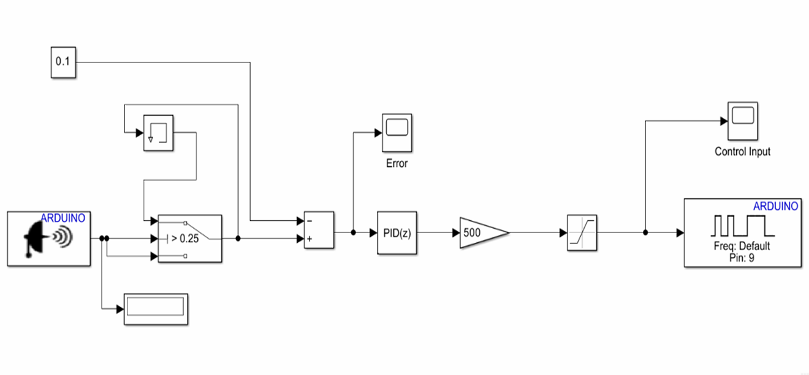
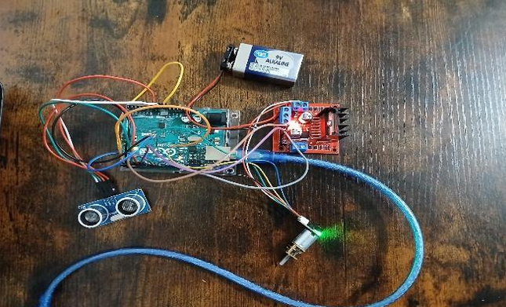

# Ultrasonic-PID-Motor-Control

Real-time closed-loop motor speed control using ultrasonic sensing, encoder feedback, and PID control deployed on Arduino via Simulink.

---

## Overview
This project implements a **real-time closed-loop motor control system** where motor speed is dynamically regulated based on obstacle distance. An ultrasonic sensor provides the reference input, an encoder supplies feedback, and a PID controller computes corrective control actions that are deployed directly to an Arduino via Simulink’s model-based design workflow.

The system demonstrates **sensor integration, control logic design, embedded deployment, and real hardware validation** in a compact and reproducible setup.

## **System Architecture**



## Mathematical Model of Control System

The system is formulated as a standard closed-loop feedback control problem, where the objective is to regulate motor speed based on a dynamically varying reference derived from ultrasonic distance measurements.

### Error Definition

The control error is defined as:

$$
e(t) = r(t) - y(t)
$$

Where:
- $r(t)$: Reference signal (distance-based input from ultrasonic sensor).
- $y(t)$: System output (measured motor speed from encoder).

### PID Control Law

The control input $u(t)$, which is mapped to the motor actuation signal (PWM), is computed using a classical PID controller:

$$
u(t) = K_p e(t) + K_i \int e(t)dt + K_d \frac{de(t)}{dt}
$$

Where:
- $K_p$: Proportional gain.
- $K_i$: Integral gain.
- $K_d$: Derivative gain.

### Term-wise Interpretation

- **Proportional Term ($K_p e(t)$)**  
  Provides immediate response to the current error. Higher values increase responsiveness but may induce oscillations.

- **Integral Term ($K_i \int e(t)\,dt$)**  
  Accumulates past error to eliminate steady-state offset caused by system nonlinearities such as friction and load variations.

- **Derivative Term ($K_d \frac{de(t)}{dt}$)**  
  Predicts future error trends and adds damping, improving transient response and reducing overshoot.

### Control-to-Actuation Mapping

The continuous control signal $u(t)$ is converted into a PWM duty cycle:

$$
V_{\text{avg}} = D \cdot V_{\text{max}}, \quad D \in [0,1]
$$

Where:
- $D$: Duty cycle corresponding to normalized control input.
- $V_{\text{max}}$: Supply voltage to the motor driver.

This PWM signal is applied via the L298N motor driver to regulate motor speed.

### System Interpretation

The complete control loop can be summarized as:

$$
\text{Distance (Sensor)} \rightarrow r(t) \rightarrow e(t) \rightarrow \text{PID} \rightarrow u(t) \rightarrow \text{PWM} \rightarrow \text{Motor} \rightarrow y(t)
$$

This represents a real-time feedback system where the controller continuously adjusts motor input to track a dynamically changing reference signal.

**Control flow:**

```
Ultrasonic Sensor → Error Computation → PID Controller → PWM Output → Motor
                                              ↑
                                       Encoder Feedback
```

## **Hardware Setup**


**Components used:**

- Arduino Uno.
- HC-SR04 Ultrasonic Sensor.
- Encoder DC Gear Motor.
- L298N Dual H-Bridge Motor Driver.
- External power supply.

## **Control Strategy**

- **Control Type:** Classical PID.
- **Feedback:** Encoder-based speed measurement.
- **Reference:** Distance-based input from ultrasonic sensor.
- **Deployment:** Simulink → Auto-generated Arduino code → Real-time execution.

The PID controller adapts motor speed smoothly as the measured distance varies, achieving stable closed-loop behavior around the target region.

## **Results**
- Stable motor speed regulation across varying distances.
- Smooth transient response near the target distance.
- Minimal oscillations due to effective PID tuning.
- Reliable real-time execution using Simulink-Arduino integration.

## **How to Run**

1. Open the Simulink model:

   ```
   simulink/ultrasonic_pid_motor_control.slx
   ```

2. Connect Arduino and hardware as shown.
3. Configure the correct COM port in Simulink.
4. Deploy the model to Arduino.
5. Observe real-time response via scopes and motor behavior.


## **Repository Structure**

```
Ultrasonic-PID-Motor-Control/
├── README.md
├── LICENSE
├── .gitattributes
├── .gitignore
│
├── docs/
│   ├── project_report.pdf
│   └── system_overview.png
│
├── simulink/
│   └── ultrasonic_pid_motor_control.slx
│
├── hardware/
│   └── hardware_setup.png
│
└── video/
    └── demo.mp4
```


## **Limitations**
- PID tuning is manual and system-specific.
- Ultrasonic sensing accuracy depends on surface and noise.
- L298N driver limits current capability.
- Encoder noise can affect feedback quality.

## **Future Improvements**
- Encoder signal filtering.
- Anti-windup PID implementation.
- Higher-current motor driver.
- Model-based tuning and system identification.
- Extension to trajectory or velocity control.

---

## **Documentation**
Detailed system description, results, and analysis are available in:

```
docs/project_report.pdf
```

---

# **Author**
# **Ayushman Mishra**  

LinkedIn: https://www.linkedin.com/in/aymisxx

GitHub: https://github.com/aymisxx

## **License**
This project is licensed under the MIT License.

---